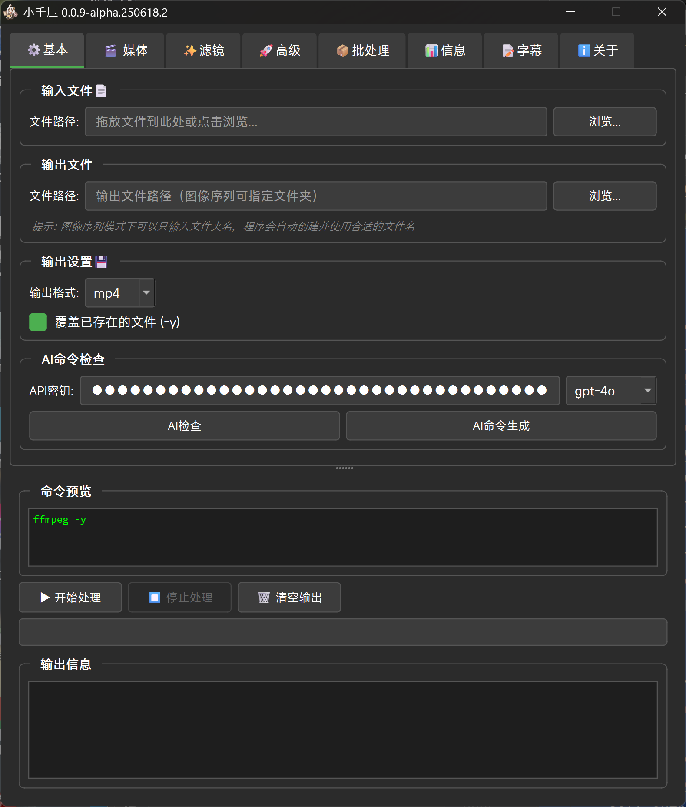

# 小千压 ( ちやちゃん ChiyaChan )

  
  
  
  **基于 FFmpeg 的媒体处理工具**
  
  
  

## 📌 关于本项目

空闲时间随便写写的，小丸新版也不发布，就自己写着玩玩了。

视频音频图像处理软件，调用 FFmpeg，支持 FFmpeg 的绝大多数功能。

> ⚠️ **注意事项**
> - 目前为 **Alpha 测试版**，会出现各种 bug，功能不完善等，请知悉
> - **请勿在生产环境使用**，后果概不负责
> - exe 中未封装 FFmpeg，需要自行手动安装并配置环境变量

## 🚀 快速开始

1. **下载 FFmpeg**
   - 前往 [FFmpeg 官网](https://ffmpeg.org/download.html) 下载
   - 解压并将 `ffmpeg.exe` 所在目录添加到系统 PATH

2. **下载小千压**
   - 从 [Release 页面](https://github.com/ChiyaChan-Release/releases) 下载最新版本
   - 解压后直接运行 `ChiyaChan.exe`

## ✨ 主要功能

- 🎬 **视频处理**：转码、压缩、裁剪、合并
- 🎵 **音频处理**：格式转换、音量调整、降噪
- 🖼️ **图像序列**：视频转序列帧、序列帧转视频
- 📦 **批量处理**：文件夹批量转换
- 🤖 **AI 辅助**：命令检查和生成（需要 API Key）
- 📝 **字幕处理**：提取、封装字幕

## 📸 界面预览

  

## 🔧 系统要求

- Windows 10/11（其他系统未测试）
- FFmpeg（需自行安装）
- 足够的硬盘空间用于临时文件

## 💡 使用提示

- 支持拖放文件到窗口
- 输出文件会自动添加 `_output` 后缀避免覆盖
- 批处理支持保持文件夹结构
- 遇到问题可以查看输出日志

## 🐛 已知问题

- 某些特殊编码可能无法正确识别
- 批处理大量文件时可能卡顿
- AI 功能需要稳定的网络连接
- 可能还存在其他未发现的 bug

## 📝 更新日志

随时更新... README 也随时更新....

最新版本请查看 [Releases](https://github.com/ChiyaChan-Release/releases)

## 🤝 反馈

- 发现 Bug 或有建议请提 [Issue](https://github.com/ChiyaChan-Release/issues)
- 邮箱：tammcx@gmail.com

## ⚖️ 免责声明

本软件仅供学习交流使用，使用本软件处理的任何文件所产生的一切后果由用户自行承担。

---

  Made with ❤️ by 千石まよひ

